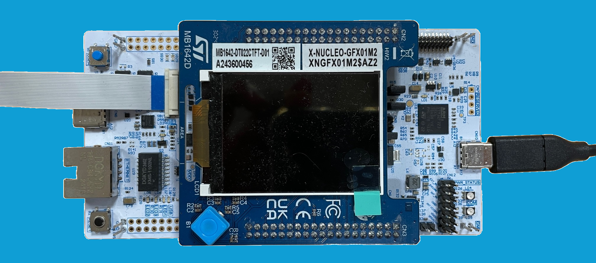
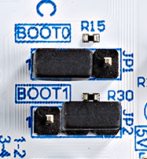

# x-cube-n6-ai-people-detection-tracking Application

Computer Vision application demonstrating the deployment of object detection models on the STM32N6570-DK or NUCLEO-N657X0-Q board.

This application is prebuilt with a people detection model, "YoloX" for STM32N6570-DK and "TinyYOLOv2" for NUCLEO-N657X0-Q.

This top readme gives an overview of the app. Additional documentation is available in the [Doc](./Doc/) folder.


---

## Doc Folder Content

- [Application Overview](Doc/Application-Overview.md)
- [Boot Overview](Doc/Boot-Overview.md)
- [Camera Build Options](Doc/Build-Options.md)

---

## Features Demonstrated in This Example

- Multi-threaded application flow (FreeRTOS)
- Tracking and box filtering (STM32N6570-DK only)
- NPU accelerated quantized AI model inference
- Dual DCMIPP pipes
- DCMIPP crop, decimation, downscale
- LTDC dual-layer implementation
- DCMIPP ISP usage
- Dev mode
- Boot from External Flash

---

## Hardware Support

Supported development platforms:

- [STM32N6570-DK](https://www.st.com/en/evaluation-tools/stm32n6570-dk.html) Discovery Board
  - Connect to the onboard ST-LINK debug adapter (CN6) using a __USB-C to USB-C cable__ for sufficient power.
  - OTP fuses are configured for xSPI IOs to achieve maximum speed (200MHz) on xSPI interfaces.
- [NUCLEO-N657X0-Q](https://www.st.com/en/evaluation-tools/nucleo-n657x0-q.html) Nucleo Board
  - Connect to the onboard ST-LINK debug adapter (CN9) using a __USB-C to USB-C cable__ for sufficient power.
  - OTP fuses are configured for xSPI IOs to achieve maximum speed (200MHz) on xSPI interfaces.


STM32N6570-DK board with MB1854B IMX335.

Supported camera modules:

- Provided IMX335 camera module
- [STEVAL-55G1MBI](https://www.st.com/en/evaluation-tools/steval-55g1mbi.html)
- [STEVAL-66GYMAI1](https://www.st.com/en/evaluation-tools/steval-66gymai.html)

For the Nucleo board, one of the following displays is required:

- A USB host for data transmission via USB/UVC (using the USB OTG port CN8)


NUCLEO-N657X0-Q board with USB/UVC display.

- [X-NUCLEO-GFX01M2](https://www.st.com/en/evaluation-tools/x-nucleo-gfx01m2.html) SPI display


NUCLEO-N657X0-Q board with SPI display.

---

## Tools Version

- IAR Embedded Workbench for Arm (__EWARM 9.40.1__) + N6 patch ([__EWARMv9_STM32N6xx_V1.0.0__](STM32Cube_FW_N6/Utilities/PC_Software/EWARMv9_STM32N6xx_V1.0.0.zip))
- [STM32CubeIDE](https://www.st.com/content/st_com/en/products/development-tools/software-development-tools/stm32-software-development-tools/stm32-ides/stm32cubeide.html) (__v1.17.0__)
- [STM32CubeProgrammer](https://www.st.com/en/development-tools/stm32cubeprog.html) (__v2.18.0__)
- [STEdgeAI](https://www.st.com/en/development-tools/stedgeai-core.html) (__v2.2.0__)

---

## Boot Modes

The STM32N6 series does not have internal flash memory. To retain firmware after a reboot, program it into the external flash. Alternatively, you can load firmware directly into SRAM (development mode), but note that the program will be lost if the board is powered off in this mode.

Development Mode: used for loading firmware into RAM during a debug session or for programming firmware into external flash.

Boot from Flash: used to boot firmware from external flash.

|                  | STM32N6570-DK                                                                | NUCLEO-N657X0-Q                                                                      |
| -------------    | -------------                                                                |-----------------                                                                     |
| Boot from flash  |  |      |
| Development mode |        |            |

---

## Console parameters

You can see application messages by attaching a console application to the ST-Link console output. Use the following console parameters:
- Baud rate of 115200 bps.
- No parity.
- One stop bit.

---

## Tracking

You can toggle tracking at runtime using button USER1 for STM32N6570-DK.

---

## Quickstart Using Prebuilt Binaries

### Flash Prebuilt Binaries

Three binaries must be programmed into the board's external flash using the following procedure:

#### STM32N6570-DK

  1. Set the board to [development mode](#boot-modes).
  2. Program `Binary/ai_fsbl.hex` (To be done once) (First stage boot loader).
  3. Program `Binary/network_data-dk.hex` (parameters of the networks; To be changed only when the network is changed).
  4. Program `Binary/x-cube-n6-ai-people-detection-tracking-dk.hex` (firmware application).
  5. Set the board to [boot from flash mode](#boot-modes).
  6. Power cycle the board.

#### NUCLEO-N657X0-Q UVC flavor

  1. Set the board to [development mode](#boot-modes).
  2. Program `Binary/ai_fsbl.hex` (To be done once) (First stage boot loader).
  3. Program `Binary/network_data-nucleo.hex` (parameters of the networks; To be changed only when the network is changed).
  4. Program `Binary/x-cube-n6-ai-people-detection-tracking-nucleo-uvc.hex` (firmware application).
  5. Set the board to [boot from flash mode](#boot-modes).
  6. Power cycle the board.

#### NUCLEO-N657X0-Q SPI flavor

  1. Set the board to [development mode](#boot-modes).
  2. Program `Binary/ai_fsbl.hex` (To be done once) (First stage boot loader).
  3. Program `Binary/network_data-nucleo.hex` (parameters of the networks; To be changed only when the network is changed).
  4. Program `Binary/x-cube-n6-ai-people-detection-tracking-nucleo-spi.hex` (firmware application).
  5. Set the board to [boot from flash mode](#boot-modes).
  6. Power cycle the board.

---

### How to Program Hex Files Using STM32CubeProgrammer UI

See [How to Program Hex Files STM32CubeProgrammer](Doc/Program-Hex-Files-STM32CubeProgrammer.md).

---

### How to Program Hex Files Using Command Line

Make sure to have the STM32CubeProgrammer bin folder added to your path.

Intructions below are for STM32N6570-DK. For NUCLEO-N657X0-Q you have to select one of the two nucleo project according to your use case.

```bash
export DKEL="<STM32CubeProgrammer_N6 Install Folder>/bin/ExternalLoader/MX66UW1G45G_STM32N6570-DK.stldr"

# First Stage Boot Loader
STM32_Programmer_CLI -c port=SWD mode=HOTPLUG -el $DKEL -hardRst -w Binary/ai_fsbl.hex

# Network Parameters and Biases
STM32_Programmer_CLI -c port=SWD mode=HOTPLUG -el $DKEL -hardRst -w Binary/network_data-dk.hex

# Application Firmware
STM32_Programmer_CLI -c port=SWD mode=HOTPLUG -el $DKEL -hardRst -w Binary/x-cube-n6-ai-people-detection-tracking-dk.hex
```

---

## Quickstart Using Source Code

Before building and running the application, you have to program `network_data.hex` (model weights and biases).

This step only has to be done once unless you change the AI model.
See [Quickstart Using Prebuilt Binaries](#quickstart-using-prebuilt-binaries) for details.

More information about boot modes is available at [Boot Overview](Doc/Boot-Overview.md).

### Application Build and Run - Dev Mode

Set your board to [development mode](#boot-modes).

Intructions below are for STM32N6570-DK. For NUCLEO-N657X0-Q you have to select one of the two nucleo project according to your use case.

#### STM32CubeIDE

Double click on `STM32CubeIDE/STM32N6570-DK/.project` to open the project in STM32CubeIDE. Build and run with the build and run buttons.

#### IAR EWARM

Double click on `EWARM/STM32N6570-DK/x-cube-n6-ai-people-detection-tracking-dk.eww` to open the project in IAR IDE. Build and run with the build and run buttons.

#### Makefile

Before running the commands below, be sure to have the commands in your PATH.

1. Build the project using the provided `Makefile`:

```bash
make -j8
```

2. Open a GDB server connected to the STM32 target:

```bash
ST-LINK_gdbserver -p 61234 -l 1 -d -s -cp <path-to-stm32cubeprogramer-bin-dir> -m 1 -g
```

3. In a separate terminal session, launch a GDB session to load the firmware image into the device memory:

```bash
$ arm-none-eabi-gdb build/Project.elf
(gdb) target remote :61234
(gdb) monitor reset
(gdb) load
(gdb) continue
```

---

### Application Build and Run - Boot from Flash

Set your board to [development mode](#boot-modes).

Intructions below are for STM32N6570-DK. For NUCLEO-N657X0-Q you have to select one of the two nucleo project according to your use case.

#### STM32CubeIDE

Double click on `STM32CubeIDE/STM32N6570-DK/.project` to open project in STM32CubeIDE. Build with build button.

#### IAR EWARM

Double click on `EWARM/STM32N6570-DK/x-cube-n6-ai-people-detection-tracking-dk.eww` to open project in IAR IDE. Build with build button.

#### Makefile

Before running the commands below, be sure to have them in your PATH.

1. Build project using the provided `Makefile`:

```bash
make -j8
```

Once your app is built with Makefile, STM32CubeIDE, or EWARM, you must add a signature to the bin file:
```bash
STM32_SigningTool_CLI -bin build/Project.bin -nk -t ssbl -hv 2.3 -o build/Project_sign.bin
```

You can program the signed bin file at the address `0x70100000`.

```bash
export DKEL="<STM32CubeProgrammer_N6 Install Folder>/bin/ExternalLoader/MX66UW1G45G_STM32N6570-DK.stldr"

# Adapt build path to your IDE
STM32_Programmer_CLI -c port=SWD mode=HOTPLUG -el $DKEL -hardRst -w build/Project_sign.bin 0x70100000
```

__Note__: Only the application binary needs to be programmed if `fsbl` and `network_data.hex` have already been programmed.

Set your board to [boot from flash](#boot-modes) mode and power cycle to boot from external flash.
